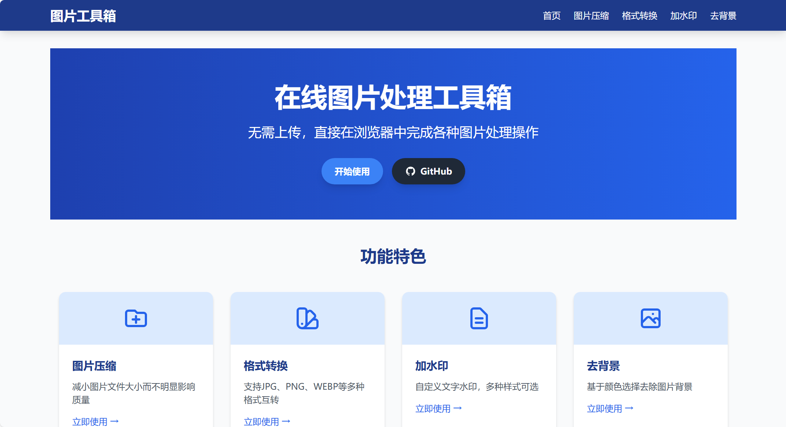
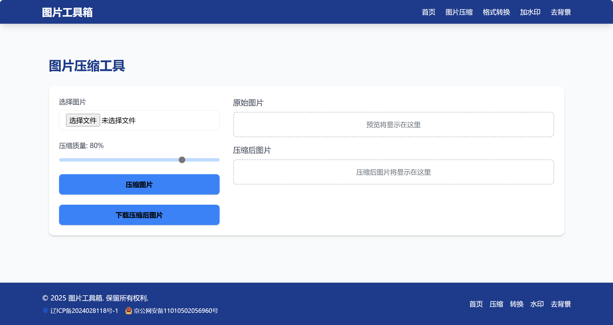
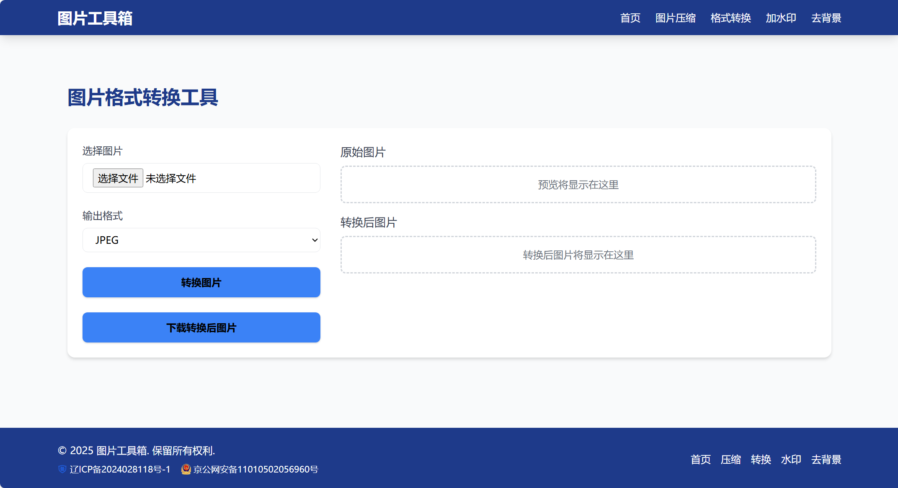
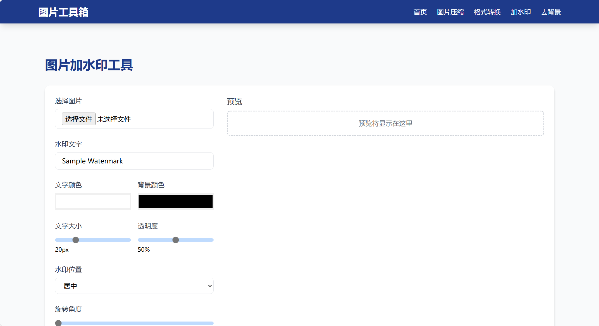
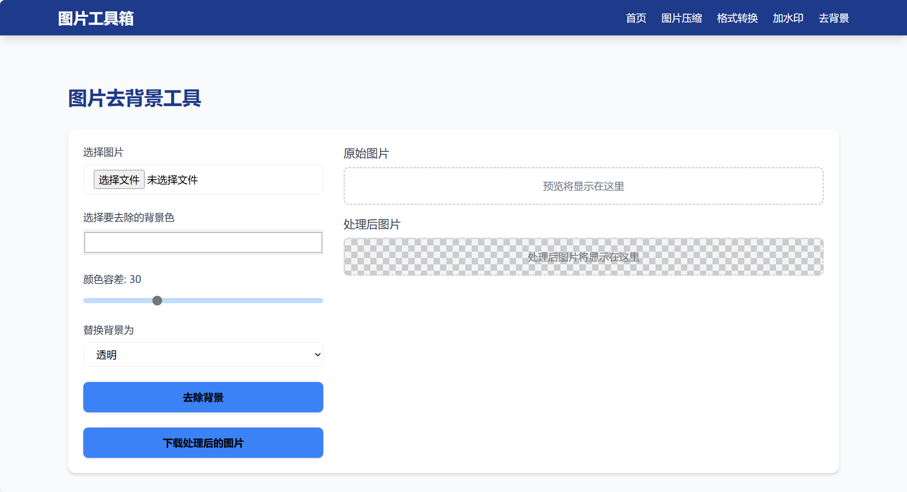

# 图片工具箱

一个基于Web的图片处理工具集，提供多种图片处理功能。
 

## 功能特性

- 图片压缩：减小图片文件大小
 
- 格式转换：支持JPG/PNG/WEBP等格式互转
 
- 添加水印：为图片添加文字或图片水印
 
- 去除背景：自动移除图片背景
 
- 批量处理：支持多张图片同时处理
- 图片免上传：支持直接在浏览器中处理图片

Demo地址：[在线图片处理工具箱 - 轻松实现图片处理](https://image-tools.yungnet.cn/)

## 使用说明

1. 访问网站首页
2. 选择需要的功能（压缩/转换/水印/去背景）
3. 上传图片文件
4. 设置处理参数
5. 下载处理后的图片

## 技术栈

- 前端：HTML5, Tailwind CSS, JavaScript
- 后端：PHP
- 图片处理库：GD Library, ImageMagick

## 安装部署

1. 确保服务器环境：
   - PHP 7.4+
   - GD库支持
   - 文件上传权限

2. 上传项目文件到Web目录

## 开源协议

[MIT License](LICENSE)

## 贡献指南

欢迎通过GitHub提交Issue或Pull Request：
https://github.com/dgsygwlkj/image-tools